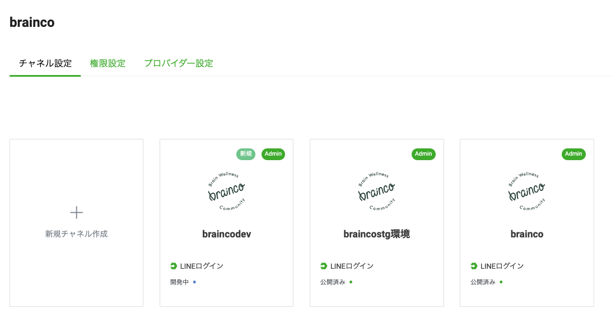

# CognitoにLINEログインを追加するまで

1.LINE Developersにサインインする
https://developers.line.biz/console/

2.プロパイダを作成

3.作成したプロバイダにチャンネルを追加する

チャンネル基本設定から、Open ID Connect申請をして保存

4.コールバックURLを開く
Congitoドメイン + /oauth2/idpresponseを設定する

5.チャンネルを公開する

6.Cognito側にLINEログインを追加する
IDPを追加する

- クライアント IDに上記LINEログインチャンネルのチャンネルIDを指定する
- クライアントのシークレットに上記LINEログインチャンネルのクライアントシークレットを指定する
- 許可されたスコープに[profile email openid]を指定する

- 発行者 URL を通じた自動入力を選択する
- 発行者 URLにhttps://access.line.meを指定する
- OpenID Connect 属性にemailを指定する

7. Cognito ホスティングUIにLINEログインを組み込む

